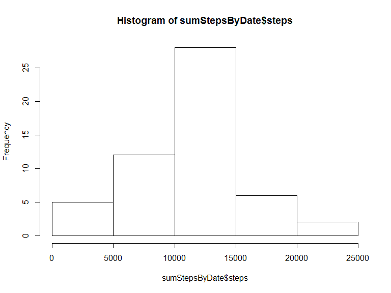
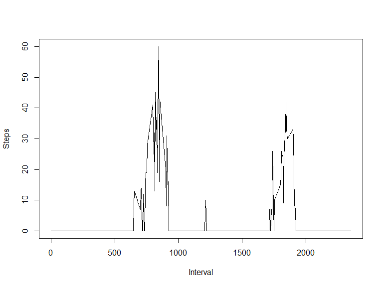
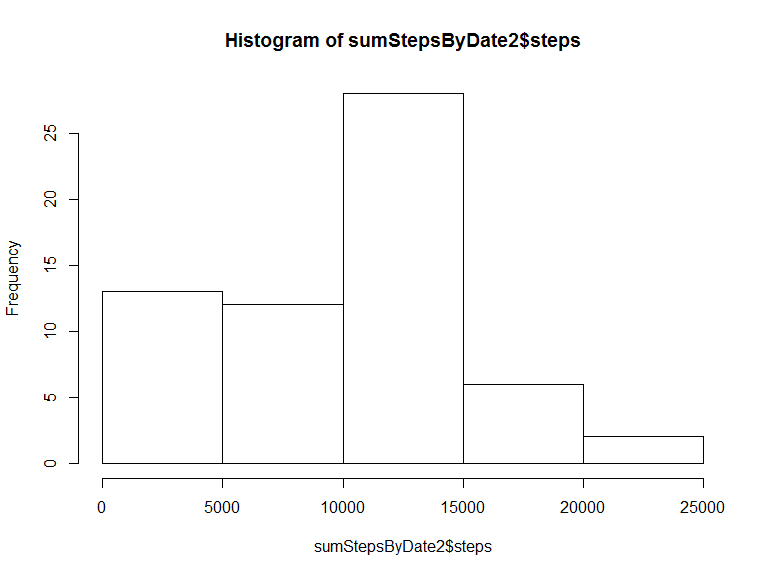
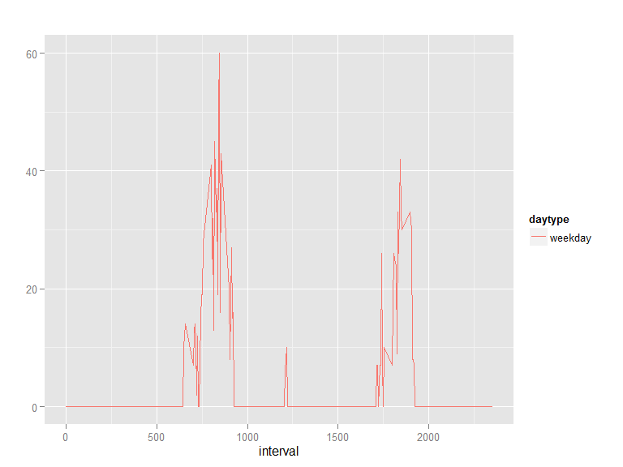

# Reproducible Research: Peer Assessment 1


```r
library(ggplot2)
library(knitr)
library(gridExtra)
```

## Loading and preprocessing the data


```r
d<-read.csv(file = "activity.csv")
```

## Histogram of the total number of steps taken each day


```r
sumStepsByDate<-aggregate(d$steps, by = list(d$date), FUN = sum)
names(sumStepsByDate)<-c("date", "steps")
hist(sumStepsByDate$steps)
```

\

## Mean and median number of steps taken each day

```r
mean(sumStepsByDate$steps, na.rm = TRUE)
```

```
## [1] 10766.19
```

```r
median(sumStepsByDate$steps, na.rm = TRUE)
```

```
## [1] 10765
```

## What is the average daily activity pattern

```r
x<-aggregate(d$steps, by = list(d$interval), FUN = median, na.rm=TRUE)
names(x)<-c("interval", "steps")
with(x, plot(x$interval, x$steps, type = 'n', ylab = 'Steps', xlab='Interval'))
with(x, lines(x$interval, x$steps, col='black'))
```

\

## Imputing missing values

### Number of missing values (NA values)

```r
NROW(which(is.na(d$steps)))
```

```
## [1] 2304
```

### Replace NA values with median steps in the interval over all days without NA values

The strategy to replace the NA values is to replace them with the median of the current interval over all days


```r
medianStepsByInterval<-aggregate(d$steps, by = list(d$interval), FUN = median, na.rm=TRUE)
names(medianStepsByInterval)<-c("interval", "steps")

d2<-d
ids<-which(is.na(d2$steps))

for(i in ids) {
  interval<-d[i,]$interval
  steps<-medianStepsByInterval[which(medianStepsByInterval$interval==interval),]$steps
  d2[i,]$steps<-steps
}
```

### Histogram of the total number of steps taken each day

```r
sumStepsByDate2<-aggregate(d2$steps, by = list(d2$date), FUN = sum)
names(sumStepsByDate2)<-c("date", "steps")
hist(sumStepsByDate2$steps)
```

\

Especially the values from range 0-5000 on the x-axis are much higher than in the first histogram

### Mean and median number of steps taken each day

```r
mean(sumStepsByDate2$steps)
```

```
## [1] 9503.869
```

```r
median(sumStepsByDate2$steps)
```

```
## [1] 10395
```

Both the mean and median value are lower compared to the first measurement.

## Are there differences in activity patterns between weekdays and weekends?

```r
daytype<-factor(c("weekday","weekend"))
d2$daytype<-ifelse(strftime(d2$date,'%u')>5,"weekend","weekday")

d2ax<-aggregate(d2$steps, by = list(d2$interval,d2$daytype), FUN = median)
names(d2ax)<-c("interval", "daytype", "steps")

d2a<-d2ax[which(d2ax$daytype=="weekday"),]
plot1<-qplot(interval, steps, color=daytype, data=d2a, geom=c("line"), ylab = '', main = '')

d2a<-d2ax[which(d2ax$daytype=="weekend"),]
plot2<-qplot(interval, steps, color=daytype, data=d2a, geom=c("line"), ylab = '', main = '')

plotList<-list(plot1,plot2)
# using lib gridextra
do.call(grid.arrange,  plotList)
```

\

From the graphs it can be concluded, that on the weekend in about the interval 900 to 1600 a much higher step amount can be seen.
